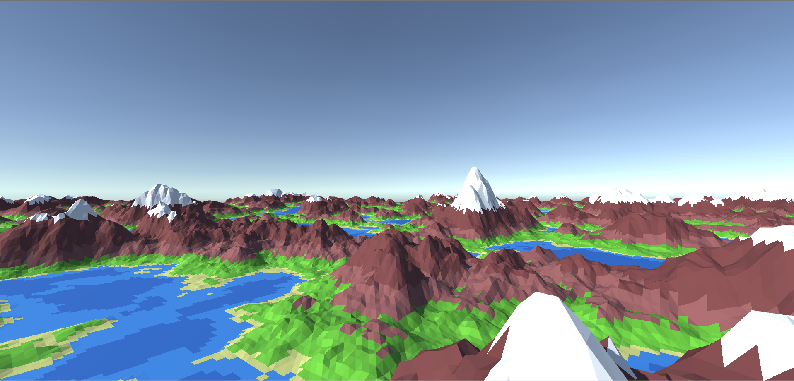

# Unity World

Simple endless low polygon world generator implemented in [Unity](https://unity.com/).

## Features

 - terrain shape based on perlin noise 
 - in editor configuration of terrain shape
 - endless area with asynchronous terrain chunks generation
 - dynamic level of detail
 - very naive and quite ugly low polygon look
 - camera movement using W,A,S,D or arrow keys
 - camera movement using joystick on mobile devices

## How it looks

## How to clone

Git [submodule](https://git-scm.com/book/en/v2/Git-Tools-Submodules) is used to include [LibNoise.Unity
](https://github.com/ricardojmendez/LibNoise.Unity) source code.

Therefor you should clone with `--recursive` flag

    git clone --recursive https://github.com/zladovan/unity-world

Or you can call following commands after regular clone

    git submodule init
    git submodule update

## Todo

 - migrate to ECS + Job System
 - improve terrain shape (combine multiple noise functions)
 - improve low poly effect 
 - add water
 - add other world objects (clouds, trees, plants, animals, ...)
 - code refactor

## Credits

Based on excellent [Procedural Landmass Generation](https://www.youtube.com/watch?v=wbpMiKiSKm8&list=PLFt_AvWsXl0eBW2EiBtl_sxmDtSgZBxB3) series by [Sebastian Lague](https://www.youtube.com/channel/UCmtyQOKKmrMVaKuRXz02jbQ).

Using [libnoise](http://libnoise.sourceforge.net/) library ported to Unity as [LibNoise.Unity
](https://github.com/ricardojmendez/LibNoise.Unity) (currently on [forked version](https://github.com/zladovan/LibNoise.Unity)).